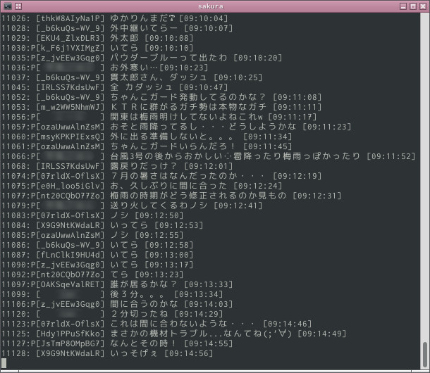
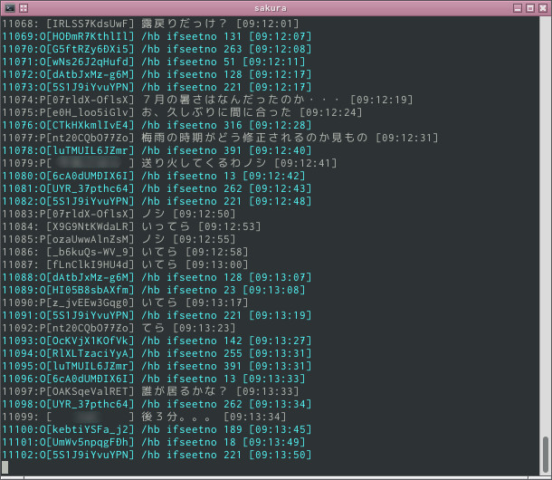
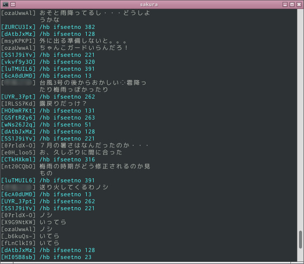

# NCV-Py

※ミュートフィルタ適用時の表示  
`./ncv-py.py "ch.nicovideo.jp/channel/ch1072" --use-filter  `

## 目次
- [これなに](#これなに)
- [特徴](#特徴)
- [使い方](#使い方)
- [ファイルについて](#ファイルについて)

## これなに

Python3製のCUIニコニコ生放送用コメントビューアです。  
モジュール分けされてあり、これを利用して自分のコメントビューアを作成することもできます。

## 特徴

* Python3の標準ライブラリのみ使用。
* コメントに対する正規表現ミュートフィルタを実装。
* 自動/手動コテハン, コテハンの固定機能。

## 使い方

Unix系であれば  
`$ ./ncv-py.py "lvXXXX"`  
`$ ./ncv-py.py "http://com.nicovideo.jp/community/coXXXX"`  
とすると利用できます。(XXXXは数字)  

引数は、放送、あるいはそのコミュニティーのURLが必須です。  
その他に、いくつかの追加のオプションがあります。  

* -h | --help  
ヘルプの表示  

* -s | --save-log  
コメントログの保存の有効化  

* -c | --cookie [COOKIE]  
使用するCookieの指定  
Cookieは、
  * Firefoxのcookie.sqlite
  * wgetの--save-cookiesでのCookie(拡張子をwgetにする必要あり)
  * Python3のhttp.cookiejar内LWPCookie

  が利用できます。  
Cookieを指定せず、cookieがまだ無い場合最初にログイン処理を行います。  

* -l | --limit  
取得する過去ログの指定(0〜1000)  

* -f | --use-filter  
コメントのミュートフィルタの有効化  

* -n | --narrow  
表示幅を狭くする  

### 通常表示
  
`./ncv-py.py "ch.nicovideo.jp/channel/ch1072"  `

### narrowオプション利用時
  
`./ncv-py.py "ch.nicovideo.jp/channel/ch1072" --narrow  `

## ファイルについて
* filter/mute-re-comment.txt  
正規表現コメントミュートフィルタ(#行はコメント扱い)  
* filter/nickname-id.txt  
生IDユーザーのコテハンファイル  
* filter/nickname-anon.txt  
184ユーザーのコテハンファイル  
* log/以下のテキストファイル  
-s | --save-logオプション有効時に、コメントのログがここに保存されます。  
* cookie/cookie.txt  
スクリプトからログインした際に保存されるCookie
